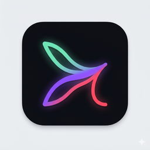
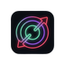

[🇬🇧 English](README.en.md) | 🇪🇸 **Español**

# Confluence Stream Deck (Beta)

Plugin de [Elgato Stream Deck](https://www.elgato.com/stream-deck) para controlar **Confluence Suite** sin tocar el teclado ni el mouse — arrancar/parar streams, publicar título/tags/categoría, y mandar mensajes al chat, todo desde botones físicos.

Build pública de [NOX TAIPAN](https://github.com/NoxTaipan). Se conecta a tu propia instancia de [confluence-beta](https://github.com/NoxTaipan/confluence-beta) (y opcionalmente a [confluence-multistream](https://github.com/NoxTaipan/confluence-multistream) via obs-websocket) corriendo en tu misma PC — no hay servidor ni cuenta compartida.



## Acciones incluidas

| Acción | Qué hace | Necesita |
|---|---|---|
| **Target de Multistream** | Arranca, para o alterna un destino RTMP (Twitch/YouTube/Kick) configurado en Confluence Multistream | obs-websocket + Confluence Multistream |
| **Stream Principal (Twitch)** | Arranca o para el output nativo de OBS (el que va a Twitch) | obs-websocket |
| **Start All** | Arranca el stream principal y todos los targets de Multistream de una | obs-websocket + Confluence Multistream |
| **Stop All** | Para todo lo anterior de una | obs-websocket + Confluence Multistream |
| **Reiniciar Confluence** | Reinicia el servidor de Confluence (stream info + chat) sin abrir OBS | tu checkout local de confluence(-beta), ver Instalación |
| **Push Stream Info** | Publica título/categoría/tags a Twitch, YouTube y Kick de una | confluence-beta corriendo |
| **Enviar Mensaje al Chat** | Manda un mensaje predefinido al chat unificado, a las plataformas que elijas | confluence-beta corriendo |
| **Crear Clip (Twitch)** | Crea un clip del stream de Twitch en vivo y abre el editor en el navegador | confluence-beta corriendo, canal de Twitch en vivo |
| **Estado de Confluence** | Muestra en la pantalla del dial (Stream Deck+) el estado del chat y del stream principal | confluence-beta + obs-websocket |

<p>
  
  
  
  
  
  
</p>

No necesitas usar todas — cada acción funciona sola si le das lo que pide en la columna "Necesita".

## Instalación

**Requisitos:** [Stream Deck app](https://www.elgato.com/downloads) 6.5+, [Node.js](https://nodejs.org) 20 (LTS), y [confluence-beta](https://github.com/NoxTaipan/confluence-beta) instalado y corriendo (para Push Stream Info / Enviar Mensaje al Chat / Reiniciar Confluence / Estado). [OBS Studio](https://obsproject.com/) con [obs-websocket](https://github.com/obsproject/obs-websocket) (viene incluido desde OBS 28+) si vas a usar las acciones de streaming.

> ⚡ **Instalación rápida:** si ya tenés (o vas a instalar) [confluence-beta](https://github.com/NoxTaipan/confluence-beta), corré su `install.bat` y elegí la opción "Solo Stream Deck" (o "Todo") — descarga este repo, corre `npm install`/`npm run build`/`npm run link` y configura `CONFLUENCE_DIR` por vos. Guía completa de todas las formas de instalar el suite: [INSTALL.md](https://github.com/NoxTaipan/confluence-beta/blob/master/INSTALL.md) ([English](https://github.com/NoxTaipan/confluence-beta/blob/master/INSTALL.en.md)). Los pasos manuales de acá abajo siguen funcionando igual.

### 1. Descargar y compilar

```bash
git clone https://github.com/NoxTaipan/confluence-streamdeck-beta.git
cd confluence-streamdeck-beta
npm install
npm run build
```

`npm run build` compila `src/*.ts` a `tv.noxtaipan.confluence.sdPlugin/bin/plugin.js` (ese archivo no viene en el repo, hay que generarlo).

### 2. Configurar la ruta a Confluence (solo si vas a usar "Reiniciar Confluence")

Esa acción necesita saber dónde clonaste `confluence-beta` en tu PC. Configuralo como variable de entorno de usuario:

```powershell
[Environment]::SetEnvironmentVariable("CONFLUENCE_DIR", "C:/ruta/a/tu/confluence-beta", "User")
```

Reinicia la Stream Deck app después de esto para que tome la variable nueva. Si no la configuras, esa acción en particular va a mostrar una alerta (❌) al presionarla en vez de fallar en silencio — el resto de las acciones no la necesitan.

### 3. Instalar el plugin en Stream Deck

```bash
npm run link
npm run restart
```

`link` registra el plugin en tu Stream Deck app (una sola vez); `restart` lo recarga cada vez que recompiles con `npm run build`. Las 9 acciones van a aparecer en la categoría **"Confluence Suite"** del panel de acciones de Stream Deck, listas para arrastrar a un botón.

### 4. Conectar con OBS y Confluence

Arrastra a un botón cualquiera de **"Push Stream Info"**, **"Enviar Mensaje al Chat"** o **"Target de Multistream"** y abrile el Property Inspector (el panel que aparece al hacer click en el botón ya puesto):

- En **Push Stream Info** / **Enviar Mensaje al Chat**: campo **URL de Confluence** — por defecto `http://127.0.0.1:7773`, cambialo solo si corres Confluence en otro puerto.
- En **Target de Multistream**: campos **Host**, **Puerto** (4455 por defecto) y **Password** de obs-websocket (Tools → obs-websocket Settings dentro de OBS para ver/generar la password).

Estos tres campos son **configuración global** — configurarlos una vez en cualquiera de esas acciones alcanza para todas.

### 5. Configurar cada botón

- **Target de Multistream**: en su Property Inspector, escribí el nombre exacto del target tal como lo agregaste en el dock de Confluence Multistream (ej. "Youtube", "Kick").
- **Enviar Mensaje al Chat**: escribí el mensaje predefinido y elegí a qué plataformas se manda.
- **Push Stream Info**: no necesita más configuración, publica lo que ya tengas cargado en el dock de Confluence.

## Suite completa

Este plugin es una pieza de **Confluence Suite** — podés usarlo solo o junto con el resto:

| Repo | Qué es |
|---|---|
| [confluence-beta](https://github.com/NoxTaipan/confluence-beta) | El panel web (OBS dock): título/tags/categoría + chat unificado de Twitch/YouTube/Kick. Hace falta corriendo para casi todas las acciones de este plugin. |
| [confluence-multistream](https://github.com/NoxTaipan/confluence-multistream) | Plugin nativo de OBS para mandar el video a varios destinos RTMP a la vez. Opcional — solo lo necesitas para las acciones de multistream/start-all/stop-all. |
| **confluence-streamdeck-beta** (este repo) | Controla todo lo anterior desde un Stream Deck. |

## Soporte

Todo lo que publico en GitHub — incluido este repo — es gratis y de código abierto, siempre. Si te sirve y querés apoyar el mantenimiento, invitame un café:

[](https://ko-fi.com/noxtaipan)

Aparte, en [Gumroad](https://noxtaipan.gumroad.com/) vendo otros productos — eso sí tiene costo, para que quede claro.

Issues y PRs son bienvenidos.

## Licencia

[MIT](LICENSE)
